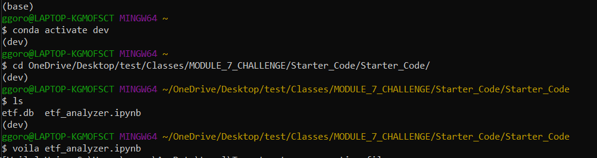

# Fintech Bootcamp Challenge 7

Development of financial database and web application using SQL, Python, and Voila library to analyze the performance of a fintech ETF.

   - Analyzed a single asset in the ETF

   - Optimized data access with advanced SQL queries

   - Analyzed the ETF portfolio

   - Deployed the notebook as a web application

# Technologies

    Python 3.7
    Python Code
    Python notebooks (.ipynb files).
    
### Lbraries Used:

    pandas
    numpy
    sqlalchemy
    hvplot
    voila
 
# Installation Guide

Before running the application first install the following dependencies

 - pandas
 - nympy
 - hvplot.pandas
 - sqlalchemy
  
  
# Usage

Review the analysis results, code, notebook file and web application for visual and table data and analysis.

to open web application using Voila input the following code into your terminal:

Voila results:

https://user-images.githubusercontent.com/111473898/206113234-939b1328-58da-4f79-9b7f-ebcbc012162f.mp4

# Contributors

Gorovodskiy, Herman (ggorovod01@gmail.com)

# License 

MIT
